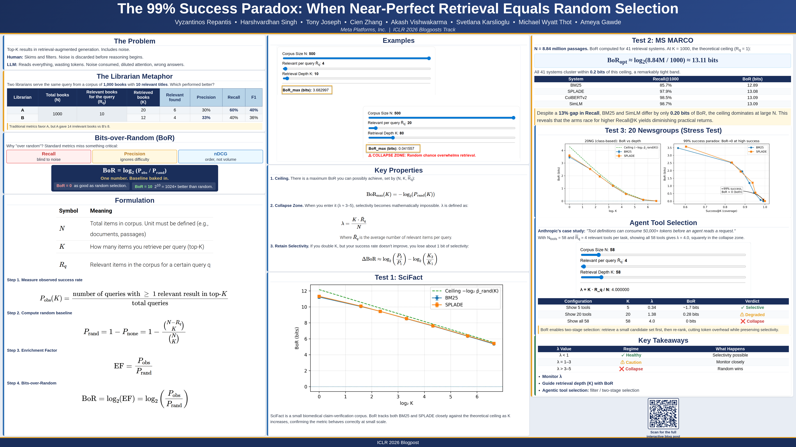

# Bits-over-Random

Small Python utilities for chance-corrected retrieval evaluation.

Based on the ICLR 2026 Blog Poster Track paper:

**The 99% Success Paradox: When Near-Perfect Retrieval Equals Random Selection**



[Blog](https://iclr-blogposts.github.io/2026/blog/2026/bits-over-random/) |
[Poster](https://iclr.cc/virtual/2026/poster/10012083)

## Why this exists

Raw retrieval metrics such as Success@K and Recall@K can look strong when random selection would also succeed.

Bits-over-Random compares observed success against the success expected from a blind draw over the same corpus.

Each bit is one doubling over random chance.

## What BoR measures

For a corpus of N items with R relevant items, and a retrieval depth K, random selection has its own success rate.

BoR asks:

> How many bits better than random was the observed retrieval result?

- BoR = log2(P_observed / P_random)
- BoR = 0: no better than random
- BoR = 1: 2x better than random
- BoR = 3: 8x better than random
- BoR < 0: worse than random

## Install locally

Before using, install:

```bash
pip install -e .
```

## Quick example

```python
from bor import random_success_at_least_one, bits_over_random

N = 400_000
R = 20_000  # 5% of the corpus
K = 100

p_rand = random_success_at_least_one(N=N, R=R, K=K)
bor = bits_over_random(observed=1.0, random_baseline=p_rand)

print(p_rand)  # about 0.994
print(bor)     # near zero bits
```

## Command line

```bash
bor --N 400000 --R 20000 --K 100 --observed 1.0
```

Example output:

```bash
Random baseline: 0.9941
Bits-over-Random: 0.0086
lambda: 5.0000
warning: random baseline is already near 1.0
warning: lambda is in the collapse zone
```

## Audit a retrieval log

The calculator above answers a single aggregate question. The auditor
answers the production one: given a log of many retrieval events, each
with its own pool size, depth, and outcome, is the system actually
selective?

It reads JSONL or CSV logs, runs locally, and nothing leaves the
machine.

```bash
bor audit my_retrieval_log.jsonl
```

Example output:

```bash
BoR Audit
==========================================================
queries analyzed          : 800
observed success (P_obs)  : 0.8113
random baseline (P_rand)  : 0.3351
Bits-over-Random          : +1.2758  [95% CI +1.2297, +1.3199]
BoR ceiling (mean)        : 1.6481
lambda (mean)             : 0.4015
collapse-zone queries     : 0%
----------------------------------------------------------
SELECTIVE: 1.28 bits over random, about 2.4x better than a blind draw at this depth.
```

### Log format

Each row needs a pool size, a retrieval depth, and a success signal.
Common field names are recognized automatically:

| Field | Recognized names                                              |
| ----- | ------------------------------------------------------------- |
| N     | `N`, `n`, `pool_size`, `corpus_size`, `num_candidates`, `total` |
| K     | `K`, `k`, `depth`, `top_k`, `num_shown`, `num_retrieved`        |
| hit   | `hit`, `success`, `found`, `solved`, `task_success`             |
| R     | `R`, `r`, `relevant`, `num_relevant`, `relevant_count`          |

A typical row:

```json
{"query_id": "req-00041", "pool_size": 600, "top_k": 40, "num_relevant": 6, "found": true}
```

If your log uses other names, pass an explicit mapping:

```bash
bor audit my_log.jsonl --map N=corpus,K=shown,hit=ok,R=rel
```

### When the log has no relevant count

Most logs keep scores and outcomes but drop R. Two honest options:

```bash
bor audit my_log.jsonl --default-R 6     # same R for every row
bor audit my_log.jsonl --R-frac 0.05     # estimate R as 5% of N per row
```

Both are estimates and the output says so. Treat the resulting BoR as
an estimate too.

### From Python

```python
from bor import audit, from_jsonl

records = from_jsonl("my_retrieval_log.jsonl", R_frac=0.05)
result = audit(records)
print(result.summary())
```

`audit` also accepts `QueryRecord` objects directly if your data is
already in memory, and each record takes an optional `m` for success
defined as at least m relevant items in the top K.

## Examples

```bash
python examples/case2_lottery.py
python examples/tool_selection_58.py
python examples/audit_logs_demo.py   # writes a synthetic log, audits it
```

## Intuition

Retrieval systems are often evaluated by whether at least one relevant item appears in the top K. That is useful, but it does not ask how hard the task was.

If relevant items are common, or K is large, a blind draw can also succeed. BoR asks how far above that random baseline the system actually is.

## Citation

If you use this code, please cite:

```bibtex
Repantis et al., "The 99% Success Paradox: When Near-Perfect Retrieval Equals Random Selection," ICLR Blogposts, 2026.
```

BibTeX citation:

```bibtex
@inproceedings{repantis2026the99success,
  author = {Repantis, Vyzantinos and Singh, Harshvardhan and Joseph, Tony and Zhang, Cien and Vishwakarma, Akash and Karslioglu, Svetlana and Thot, Michael Wyatt and Gawde, Ameya},
  title = {The 99% Success Paradox: When Near-Perfect Retrieval Equals Random Selection},
  abstract = {For most of the history of information retrieval (IR), search results were designed for human consumers who could scan, filter, and discard irrelevant information on their own. This shaped retrieval systems to optimize for finding and ranking more relevant documents, but not keeping results clean and minimal, as the human was the final filter. However, LLMs have changed that by lacking this filtering ability. To address this, we introduce Bits-over-Random (BoR), a chance-corrected measure of retrieval selectivity that reveals when high success rates mask random-level performance.},
  booktitle = {ICLR Blogposts 2026},
  year = {2026},
  date = {April 27, 2026},
  note = {https://iclr-blogposts.github.io/2026/blog/2026/bits-over-random/},
  url  = {https://iclr-blogposts.github.io/2026/blog/2026/bits-over-random/}
}
```